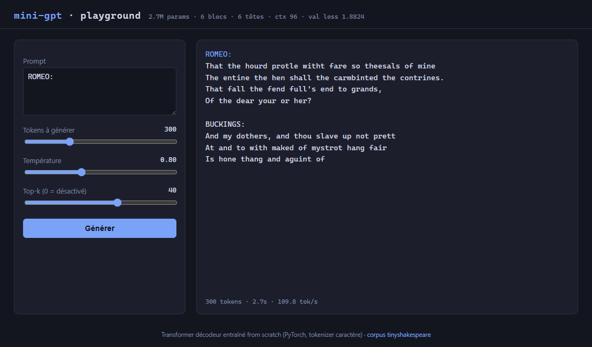
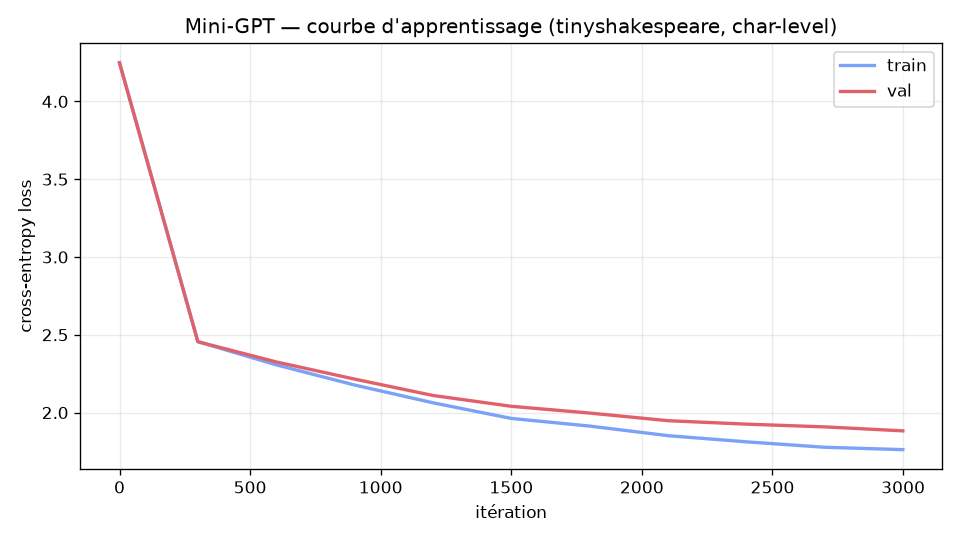

# mini-gpt

[](https://github.com/OWNER/mini-gpt/actions/workflows/ci.yml)
[](https://www.python.org/)
[](https://pytorch.org/)
[](LICENSE)

[English](README.md) | **Français**

Un Transformer décodeur style GPT **implémenté from scratch en PyTorch pur** —
sans `nn.Transformer`, sans `nn.MultiheadAttention`, sans HuggingFace, sans tiktoken.
Entraîné au niveau caractère sur tinyshakespeare, il apprend à écrire du
pseudo-Shakespeare en ~20 minutes sur le CPU d'un portable.

L'objectif : comprendre chaque composant d'un GPT en le reconstruisant à la main —
tokenizer, attention causale multi-têtes, blocs résiduels pré-norm, boucle
d'entraînement, LR schedule, échantillonnage. Chaque fichier est abondamment
commenté en français : le code se lit comme un cours.



## Contenu

| Composant | Détails |
|---|---|
| [`tokenizer.py`](src/tokenizer.py) | Tokenizer caractère, vocabulaire déterministe, persistance JSON |
| [`model.py`](src/model.py) | Attention causale multi-têtes (QKV fusionné), blocs pré-norm, FFN GELU, embeddings positionnels appris, **weight tying**, init GPT-2 avec scaling résiduel 1/√(2·n_layer) |
| [`train.py`](src/train.py) | AdamW avec weight decay sélectif (params 2D uniquement), warmup linéaire + cosine decay, gradient clipping, sauvegarde du meilleur checkpoint, métriques CSV |
| [`sample.py`](src/sample.py) | Échantillonnage température + top-k, **génération en streaming** (générateur token par token) |
| [`serve.py`](src/serve.py) | Playground web avec streaming des tokens en direct — `http.server` de la stdlib, zéro dépendance web |
| [`tests/`](tests/) | 25 tests pytest (causalité, shapes, statistiques d'init, weight tying, LR schedule, streaming) — exécutés en CI |

## Démarrage rapide

```bash
git clone https://github.com/OWNER/mini-gpt.git
cd mini-gpt
python -m venv .venv
.venv\Scripts\Activate.ps1        # Windows — ou : source .venv/bin/activate
pip install -r requirements.txt
```

**Entraîner** (corpus inclus — [tinyshakespeare](data/input.txt), 1,1 Mo de Shakespeare, domaine public) :

```bash
python src/train.py --preset cpu-small     # le plus petit modèle, premier run rapide
python src/train.py --preset cpu-medium    # ~30 min sur CPU portable — le modèle montré ci-dessous
python src/train.py --preset gpu           # config complète, quelques minutes avec CUDA
```

| Preset | Couches | Têtes | Embed | Contexte | Params | Val loss |
|---|---|---|---|---|---|---|
| `cpu-small` | 4 | 4 | 128 | 64 | 0,8 M | ≈ 1,9 |
| `cpu-medium` | 6 | 6 | 192 | 96 | 2,7 M | **1,88** |
| `gpu` | 6 | 6 | 192 | 128 | 2,7 M | — |

**Générer** en ligne de commande :

```bash
python src/sample.py --prompt "ROMEO:" --max_new_tokens 300 --temperature 0.8 --top_k 40
```

**Ou lancer le playground web** (les caractères apparaissent au fil de l'échantillonnage,
façon ChatGPT — ~100 tokens/s sur un CPU portable) :

```bash
python src/serve.py        # -> http://127.0.0.1:8000
```

## Résultats

Courbe d'apprentissage pour `cpu-medium` (2,7 M params, 3 000 itérations, ~30 min sur CPU portable).
L'entraînement est seedé de bout en bout : deux runs identiques convergent exactement
vers la même val loss de 1,8824.



Exemple de génération après entraînement (`--temperature 0.75 --top_k 40`) :

```text
KING HENRY:
Prick with your hearth the arry his well,
And good many king with dike it at her,
And frectious cancecious that hath frierl th.
Orw knotherer be one the that not do,
Sondire of mide hall all thou have prestenced,
This to curting and, the the soul for and her.

QUEEN ELIZABET:
Wo, what here be it somet:
Shall the chent to shir and him where ploke...
```

Ce n'est pas encore du Shakespeare — mais pour un modèle de 2,7 M de paramètres
parti de poids aléatoires une demi-heure plus tôt, sur un portable, avec un
tokenizer caractère : de vrais mots anglais, des longueurs de vers plausibles,
la structure théâtrale, et une QUEEN ELIZABET qui répond spontanément à un
KING HENRY.

## Architecture

```text
idx (B, T) tokens entiers
  ├─ embedding de tokens      (B, T) -> (B, T, C)
  ├─ embedding de positions   + (1, T, C)   appris, additif
  ▼
N × Block :                   pré-norm, résiduel
  x = x + MHSA(LN(x))         attention causale multi-têtes
  x = x + FFN(LN(x))          Linear(C→4C) → GELU → Linear(4C→C)
  ▼
LayerNorm
  ▼
lm_head                       (B, T, C) -> (B, T, vocab)   poids partagés avec l'embedding
```

Les choix de conception suivent GPT-2 : blocs pré-norm (gradients stables en
profondeur), projection QKV fusionnée, weight tying entre l'embedding d'entrée
et la tête de sortie, init N(0, 0.02) avec les projections résiduelles scalées
par 1/√(2·n_layer) pour garder la variance du courant résiduel plate,
AdamW β₂ = 0,95. Chaque choix est motivé dans les commentaires du code.

## Tests

```bash
pip install -r requirements-dev.txt
pytest tests/ -v
```

Couverture : causalité de l'attention (perturber le dernier token ne doit pas
changer les sorties précédentes), loss initiale ≈ ln(vocab_size), weight tying
(même adresse mémoire), génération au-delà de block_size, équivalence
stream/batch, bornes du LR schedule, groupes de decay de l'optimiseur.

## Structure du projet

```text
mini-gpt/
├── src/
│   ├── config.py          # dataclass GPTConfig (tous les hyperparamètres)
│   ├── tokenizer.py       # CharTokenizer
│   ├── dataset.py         # split train/val + batching aléatoire
│   ├── model.py           # MultiHeadSelfAttention, Block, GPT
│   ├── train.py           # boucle d'entraînement + CLI presets
│   ├── sample.py          # génération CLI
│   └── serve.py           # playground web (stdlib uniquement)
├── web/index.html         # front-end du playground
├── tests/                 # suite pytest
├── scripts/plot_metrics.py
├── data/input.txt         # corpus tinyshakespeare (domaine public)
└── .github/workflows/ci.yml
```

## Licence

[MIT](LICENSE)
